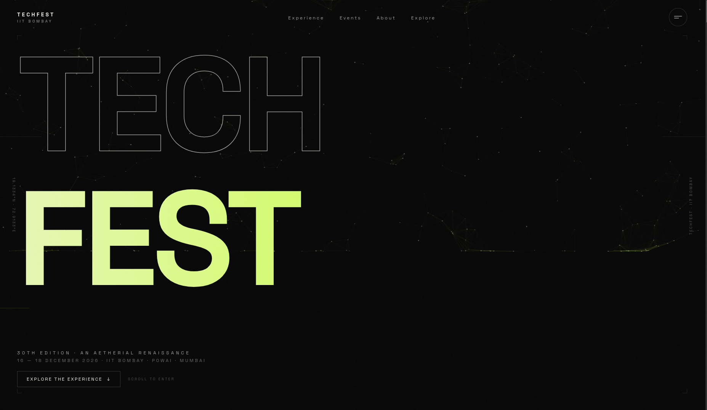

# TechFest IIT Bombay — Premium Landing Page

<div align="center">


<br/>

**A premium, animation-rich landing page for Asia's largest science & technology festival.**

<br/>



<br/>

[🔴 Live Demo](#) &nbsp;•&nbsp; [📸 Screenshots](#-screenshots) &nbsp;•&nbsp; [⚙️ Tech Stack](#%EF%B8%8F-tech-stack) &nbsp;•&nbsp; [🚀 Getting Started](#-getting-started)

</div>

---

## ✨ Overview

A **high-fidelity, production-grade landing page** for **TechFest IIT Bombay** — Asia's largest science and technology festival held annually at IIT Bombay, drawing hundreds of thousands of participants from across the globe.

Built as a front-end assignment project, this page pushes the boundaries of modern web animation and UI craft — featuring GSAP-driven horizontal scroll timelines, smooth Lenis inertia scrolling, Framer Motion transitions, and a cinematic dark aesthetic inspired by world-class event websites.

> **30th Edition · An Aetherial Renaissance · 16–18 December 2026 · IIT Bombay, Powai, Mumbai**

---

## 🎬 Features

| Section | Description |
|---|---|
| 🎥 **Hero** | Cinematic full-screen intro with animated text reveals and a live particle canvas |
| 📅 **30 Years Timeline** | GSAP horizontal scroll, chronicling milestones from 1997 → 2026 |
| ⚡ **Aetherial Engine** | Interactive WebGL/Canvas visual centrepiece |
| 🃏 **Featured Experiences** | Animated showcase cards with immersive hover effects |
| 📂 **Experience Accordion** | Framer Motion accordion with physics-based expand/collapse |
| 🔢 **Numbers Section** | Animated stat counters triggered on scroll |
| 🏛️ **Campus Section** | Immersive IIT Bombay campus feature block |
| 📣 **Final CTA** | Bold call-to-action with magnetic button effect |
| 🌊 **Smooth Scrolling** | Lenis inertia scroll throughout the entire page |
| 📱 **Fully Responsive** | Mobile-first design, works on all screen sizes |

---

## 🛠️ Tech Stack

| Category | Technology |
|---|---|
| **Framework** | React 19 |
| **Build Tool** | Vite 8 |
| **Styling** | Tailwind CSS v4 |
| **Language** | TypeScript 5.7 |
| **Animation** | GSAP 3 + ScrollTrigger |
| **Motion** | Framer Motion 13 |
| **Smooth Scroll** | Lenis |
| **Icons** | Lucide React |
| **Formatter** | oxfmt |

---

## 📸 Screenshots

<div align="center">


*Hero Section — 30th Edition · An Aetherial Renaissance*

</div>

---

## 📁 Project Structure

```
src/
├── components/
│   ├── Hero.tsx                # Full-screen animated hero
│   ├── ThirtyYears.tsx         # GSAP horizontal scroll timeline
│   ├── AetherialEngine.tsx     # Interactive canvas/visual engine
│   ├── FeaturedExperiences.tsx # Animated showcase cards
│   ├── ExperienceAccordion.tsx # Framer Motion accordion
│   ├── NumbersSection.tsx      # Animated stat counters
│   ├── CampusSection.tsx       # Campus feature block
│   ├── Manifesto.tsx           # Brand manifesto section
│   ├── FinalCTA.tsx            # Final call-to-action
│   ├── Navbar.tsx              # Navigation bar
│   ├── MobileMenu.tsx          # Mobile menu overlay
│   └── Footer.tsx              # Footer
├── hooks/
│   ├── useLenis.ts             # Smooth scroll setup
│   └── useReducedMotion.ts     # Accessibility hook
├── lib/
│   └── constants.ts            # Milestones, experiences data
├── App.tsx
├── main.tsx
└── index.css                   # Tailwind v4 + global styles
```

---

## 🚀 Getting Started

### Prerequisites
- Node.js ≥ 18
- pnpm *(recommended)* or npm

### Installation

```bash
# Clone the repository
git clone https://github.com/Rehanbagwan007/TechFest-IIT-Bombay.git

# Navigate into the project
cd TechFest-IIT-Bombay

# Install dependencies
pnpm install

# Start the dev server
pnpm dev
```

Open [http://localhost:5173](http://localhost:5173) in your browser. Hot reload is enabled by default.

### Build for Production

```bash
pnpm build
pnpm preview
```

---

## 🎨 Design Highlights

- **Color Palette** — Deep matte black `#080808` backgrounds with acid-lime `#C6FF3D` accents
- **Typography** — Display-weight variable fonts with ultra-tight tracking for a premium editorial feel
- **Micro-animations** — Every interaction has a purposeful, physics-based response
- **Horizontal Scroll** — GSAP ScrollTrigger pins the 30-year timeline for a magazine-style experience
- **Particle Canvas** — Real-time generative particle system powering the hero background
- **Performance** — `will-change`, reduced motion support, and scroll trigger cleanup for silky 60fps

---

## ♿ Accessibility

- Respects `prefers-reduced-motion` — all GSAP and Framer Motion animations are disabled for users who prefer reduced motion
- Semantic HTML5 elements throughout (`<section>`, `<article>`, `<nav>`, `aria-*` attributes)
- Keyboard navigable interactive components

---

## 📄 License

This project was built as an academic front-end assignment. All TechFest branding and identity belongs to **IIT Bombay**.

---

<div align="center">

Made with ❤️ for **TechFest IIT Bombay 2026 — An Aetherial Renaissance**

<br/>


</div>

